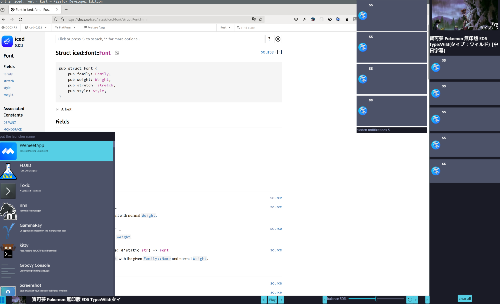

# Lala bar

It is an iced layershell program, actually it is a program like kde shell, because it contains a program with a launcher, a side bar and a notification daemon.

it is made with [iced_layershell](https://github.com/waycrate/exwlshelleventloop)

## Notification daemon

- support inline-reply
- support default action

### Todo

- timeout

## NOTE

This is more like a daemon, to show how to use iced_layershell, and how to use zbus in iced. Although it is a daemon like program, it is already enough for me, because it realizes my dream.
